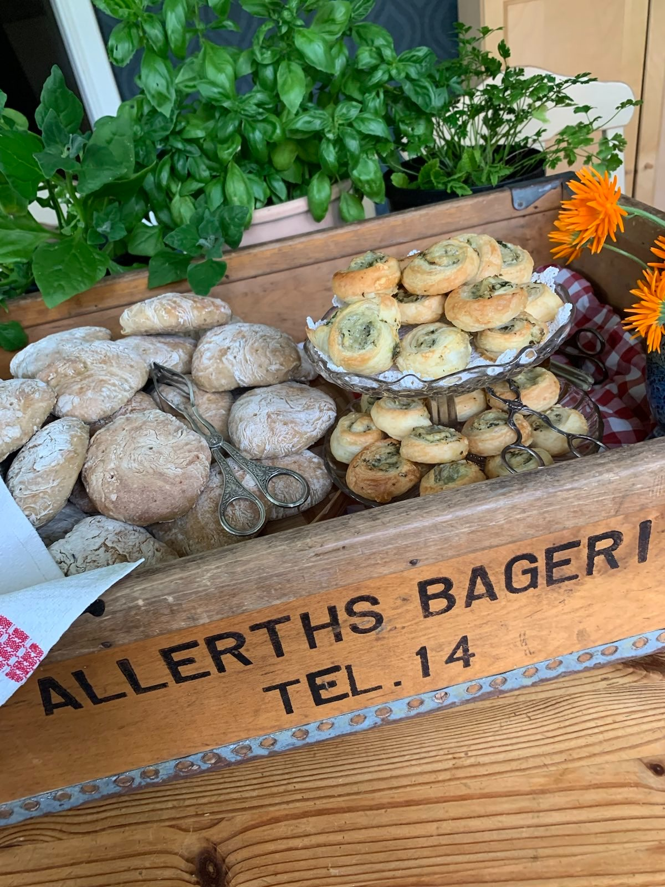

# Allerths bageri

A website made with Astro and Tailwind CSS.



## Development

Install [Node.js 20](https://nodejs.org/) and [pnpm 9](https://pnpm.io/).

```sh
git clone https://github.com/paccao/allerthsbageri.se.git && \
cd allerthsbageri.se/ && \
pnpm i && \
pnpm dev
```

## Upgrade dependencies

```sh
pnpm outdated
pnpm up
```

Check Astrojs [upgrade guides](https://docs.astro.build/en/upgrade-astro/#upgrade-guides) to upgrade major versions

```sh
pnpm dlx @astrojs/upgrade
```

## Email Spam Protection

1. Make a copy of `.env.example` and name it `.env`.
2. Add your email to `PUBLIC_EMAIL` in `.env`.
3. Add a strong random password to encrypt/decrypt your email to `PUBLIC_PASSWORD` in `.env`.
4. Open a terminal and run `pnpm encrypt:email`. Then copy the output (make sure you get every character) and add it to `PUBLIC_PAYLOAD` in `.env`.
5. Now, the email should be accessible in the `<EncryptedEmail />` component. Easily available for users, but most basic spam bots will not be able to extract the email.
