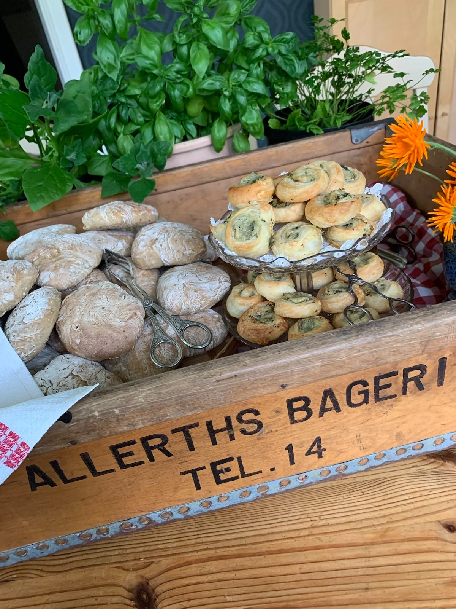

# Allerths bageri

A website made with Astro and Tailwind CSS.



## Development

Install [Node.js 24](https://nodejs.org/) and [pnpm 10](https://pnpm.io/).

```sh
git clone https://github.com/paccao/allerthsbageri.se.git && \
cd allerthsbageri.se/ && \
pnpm i && \
pnpm dev
```

## Build and run

Make sure you have a .env file setup, including the email spam protection variables.

Run from root directory of the repo:

```bash
podman build \
      -t allerthsbageri-frontend:latest \
      --build-arg PUBLIC_PAYLOAD="<copy_from_dotenv>" \
      --build-arg PUBLIC_PASSWORD="<copy_from_dotenv>" \
      --build-arg EMAIL="<copy_from_dotenv>" \
      -f frontend/Dockerfile .
# or add the --pull flag to `docker build` to pull the latest base image of the container

# Then to run the container, provide the .env file from your localhost to run it locally
podman run -p 3000:3000 --env-file=frontend/.env allerthsbageri-frontend
```

## Upgrade dependencies

For general dependencies, these commands are helpful to check versions and make updates. Be careful to review release notes, changelogs and git diffs.

```sh
pnpm outdated
pnpm up
```

Do periodically check outdated pnpm and base image version in `Dockerfile`

### Updating `shadcn-svelte` components

1. Start by making sure your local git state is clean. Then, update one [shadcn-svelte](https://shadcn-svelte.com) component at a time with this command:

```sh
pnpm dlx shadcn-svelte@latest update
```

2. Then format the code to get cleaner diffs

```sh
pnpm format
```

3. Finally, review the git diffs and manually merge the changes from remote with our local project customisations.

---

## Email Spam Protection

1. Make a copy of `.env.example` and name it `.env`.
2. Add your email to `PUBLIC_EMAIL` in `.env`.
3. Add a strong random password to encrypt/decrypt your email to `PUBLIC_PASSWORD` in `.env`.
4. Open a terminal and run `pnpm encrypt:email`. Then copy the output (make sure you get every character) and add it to `PUBLIC_PAYLOAD` in `.env`.
5. Now, the email should be accessible in the `<EncryptedEmail />` component. Easily available for users, but most basic spam bots will not be able to extract the email.

## Common issues

`podman build` gives the error:
```sh
Error: configure storage: kernel does not support overlay fs: 'overlay' is not supported over extfs at "/var/lib/containers/storage/overlay": backing file system is unsupported for this graph driver
```

This is because podman isn't configured by default to support btrfs file systems.

Solution:

[configure btrfs with podman](https://www.jwillikers.com/podman-with-btrfs-and-zfs)

I had to reboot my pc, your mileage may vary.

Check status of podman in `systemctl` or run `podman info` to verify.
